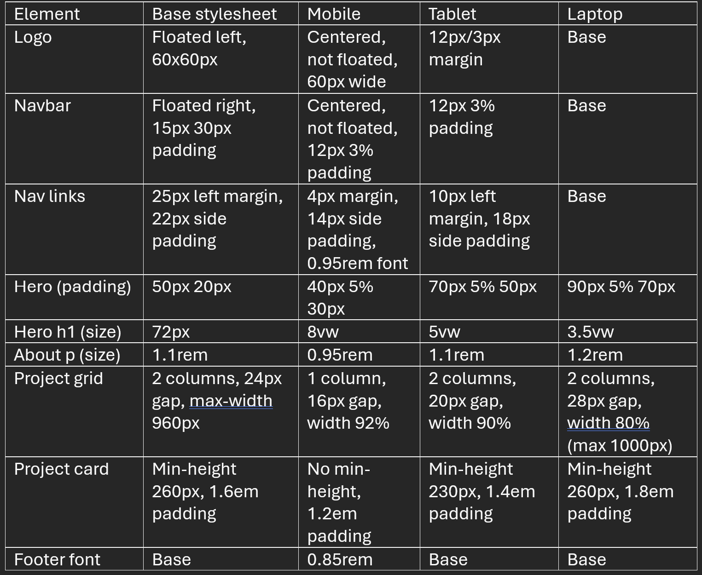
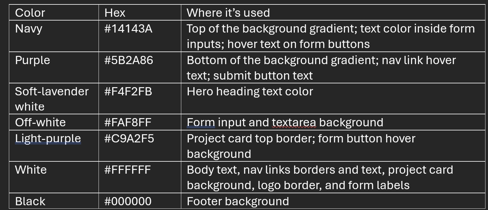

Personal Portfolio

A responsive personal portfolio website with multiple pages built with HTML5 and CSS3.
It introduces the creator (me), showcases some of my academic projects, and includes a contact form (reused from lectures). The layout adapts to mobile, tablet and laptop screens

Pages

	index.html - The Home page with my name and a short bio
	about_me.html - About Me page embedded with my introduction video
	projects.html - Projects page with grid cards of my academic projects
	contact.html - Contact Me page with a feedback form.

 

Responsive Design & Viewport Dimensions: style.css first loads on every page providing the default layout, then one of the three device-specific stylesheets loads on top of it depending on the devices screen size.

	mobile.css - up to 480px
	tablet.css - from 481px to 959px
	laptop.css - from 960px upwards

The following table shows what changes with each viewport:

 

Color Scheme:
The site uses a navy-to-purple gradient background used on all webpages, with light and soft accent colors.

 

Notes:
Feedback form was lifted from lecture code. AI was used for assistance in the logo, the cards and grid on the project page, and some values in the stylesheets.

